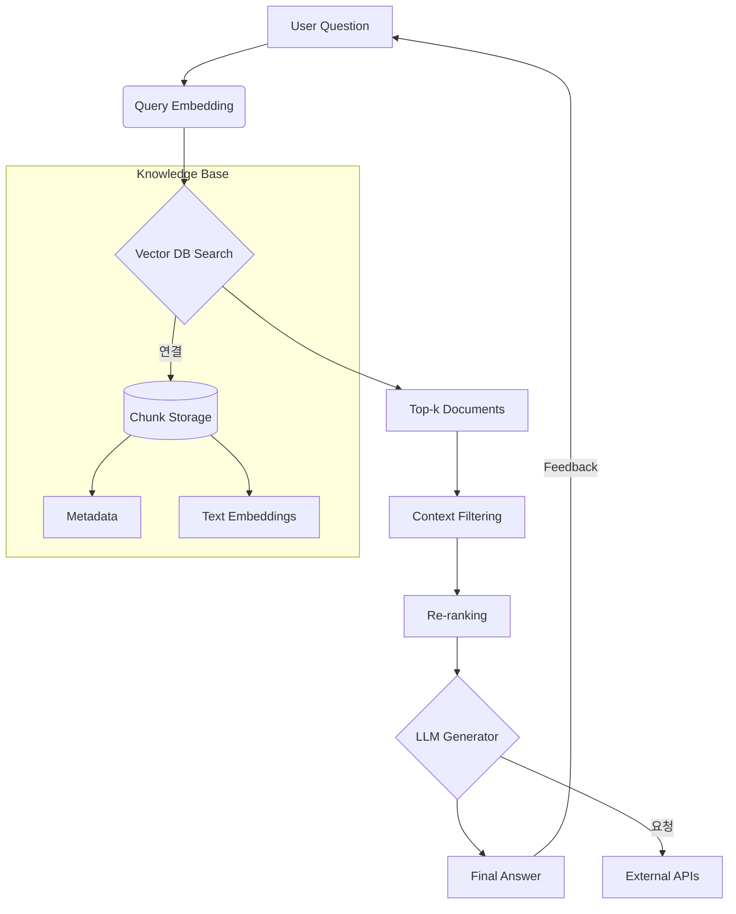

# 🧠 Large Language Models (LLMs): Fundamentals and Enhancement Techniques

LLM 기술의 핵심 개념과 향상 기법을 체계적으로 정리한 저장소입니다. 이론 설명과 실제 구현 예시를 포함합니다.

## 📚 Table of Contents
1. [LLM Overview](#-llm-overview)
2. [Enhancement Techniques](#-enhancement-techniques)
3. [Contributing](#-contributing)
4. [References](#-references)

---

## 🧩 LLM Overview

### What are LLMs?
대규모 언어 모델(LLM)은 방대한 텍스트 데이터로 학습된 딥러닝 모델로, 자연어 이해 및 생성 작업에서 인간 수준의 성능을 달성합니다.

### Model Types
| 종류          | 예시 모델       | 특징                          |
|---------------|-----------------|------------------------------|
| Autoregressive| GPT-4, LLaMA    | 순차적 텍스트 생성            |
| Autoencoder   | BERT, RoBERTa   | 양방향 문맥 이해              |
| Multimodal    | CLIP, Flamingo  | 텍스트+이미지 처리            |

---

## 🛠 Enhancement Techniques

### 1. RAG (Retrieval-Augmented Generation)
🔍 **지식 증강 생성**
- 외부 지식 베이스와 결합하여 정확도 향상
- 구현 프레임워크: LangChain, Haystack

1. **지식 베이스 명시적 표기** 
2. **실제 동작 방식 반영**
3. **핵심 컴포넌트 강조**

### 2. Fine-tuning
🎯 **도메인 특화 학습**
- 사전 학습 모델을 특정 작업에 맞춰 조정
- 주요 기법:
  - Full Fine-tuning
  - LoRA (Low-Rank Adaptation)
  - Prompt Tuning

### 3. Quantization
⚖️ **모델 경량화**
- FP32 → INT8 변환으로 4배 경량화
- 추론 속도 2-3배 향상

### 4. Multimodal Integration
🌐 **멀티티 모달 통합**
- 텍스트 + 이미지/비디오/오디오 처리
- 주요 아키텍처:
  - Cross-modal Attention
  - Fusion Networks

---
  

## 📚 References
- [Attention Is All You Need (2017)](https://arxiv.org/abs/1706.03762)
- [LoRA: Low-Rank Adaptation of Large Language Models (2021)](https://arxiv.org/abs/2106.09685)
- [Hugging Face Transformers Library](https://huggingface.co/docs/transformers)
